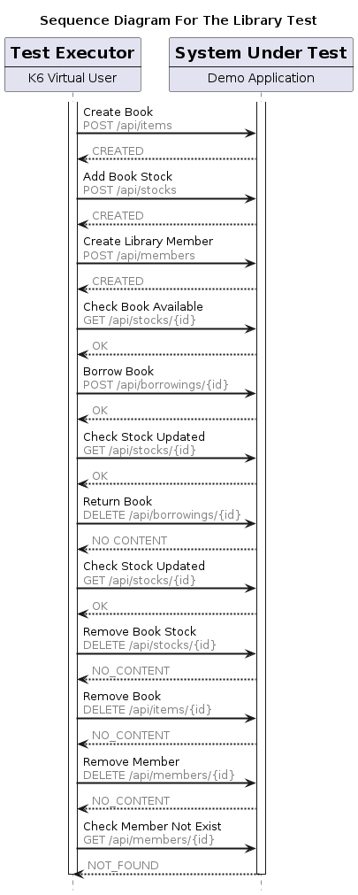
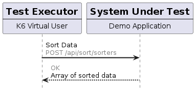

# Load test

This directory contains definitions of load tests that can be used to show performance and resource usage differences between two forms of deployment for sample Java applications:
- [JAR](https://en.wikipedia.org/wiki/JAR_(file_format))
- [Native Image](https://www.graalvm.org/latest/reference-manual/native-image/)

The tests are written using the [K6](https://k6.io/open-source/) tool

## Library Demo Test

## Sorting Test

